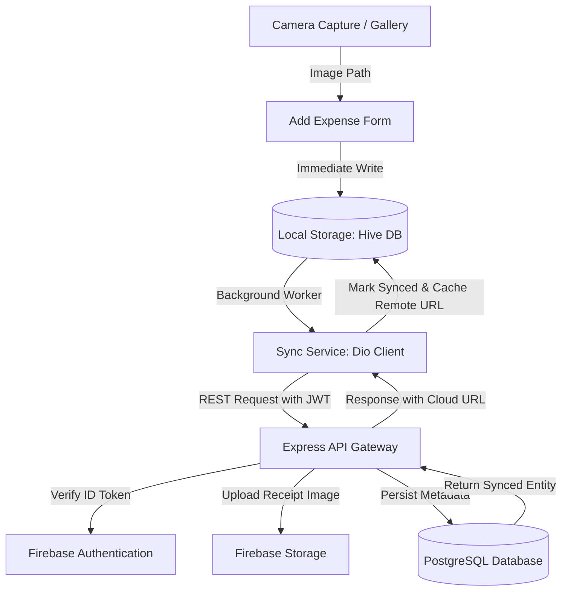

# 📸 ExpenseLens: Camera-First Expense Tracker

ExpenseLens is a modern, offline-first personal finance application built to replace tedious transaction inputs with a streamlined, **camera-first** flow. Instead of navigating endless menus, lists, or forms, the physical camera (or photo library) serves as the primary entry point: point, shoot, input the amount, tag, and keep moving.

The system quietly handles offline local caching and triggers real-time background syncs to the cloud when internet connectivity is available.

---

## 🛠️ Tech Stack & Architecture Decisions

The system architecture is engineered explicitly for **offline-first reliability** and **seamless background synchronization**.



### **1. Frontend (Mobile Client)**
*   **Framework:** Flutter (iOS & Android)
*   **State Management:** **Riverpod** — Provides reactive state propagation. UI screens dynamically update when background sync changes the data state.
*   **Local Caching:** **Hive** — A lightweight, high-performance NoSQL database written in pure Dart. Read/Write speeds are practically instantaneous, providing zero-latency interactions.
*   **Conflict-Free Caching Pattern:** Rather than relying on sluggish generators (`build_runner`), we built a **manual binary `TypeAdapter`** for the `Expense` model, resolving adapter registration compilation errors instantly.
*   **Networking:** **Dio** — Seamlessly integrates multi-part form payloads for asynchronous file-upload streams.

### **2. Backend Service**
*   **Runtime & Framework:** **Node.js** with **Express & TypeScript** (cleanly split into Controllers, Services, Models, and Middlewares).
*   **Database ORM:** **Drizzle ORM** — A type-safe SQL ORM that offers SQL-like queries with maximum speed and zero bloat.
*   **Database:** **PostgreSQL** — Chosen for its strong ACID compliance and structured transactional stability.
*   **File Storage:** **Firebase Storage** — Securely hosts raw receipt uploads, returning a persistent, authenticated Signed URL to the mobile app.
*   **Authentication:** **Firebase Authentication** — Simplifies secure token verification using robust, standards-based ID token JWT validation.

---

## 📋 Feature Checklist

- [x] **Camera-First Entry Flow** — Launch the system camera or gallery instantly with a primary action button.
- [x] **Offline-First Storage** — Hive records write immediately so the application remains fully operational offline.
- [x] **Smart Background Sync** — Detects network availability and automatically syncs pending actions to the cloud.
- [x] **Summary Bar (Bonus)** — Dynamic spending analytics showing totals for Today, Last 7 Days, and the Current Month.
- [x] **Interactive Zoom (Bonus)** — High-fidelity pinch-to-zoom on receipt photos inside the transaction detail screen.
- [x] **Omni-Search & Filter (Bonus)** — Live search indexing that filters local feeds instantly by category or keywords in notes.

---

## 📡 API Contract Specification

All endpoints are protected under Firebase ID Token authentication headers (`Authorization: Bearer <token>`).

### **1. Upload & Create Expense**
*   **Route:** `POST /expenses`
*   **Content-Type:** `multipart/form-data`
*   **Request Body Parameters:**
    | Key | Type | Description |
    | :--- | :--- | :--- |
    | `id` | `UUID` (string) | Generated on client-side to prevent duplicates during sync retries |
    | `amount` | `Number` | Transaction cost |
    | `category` | `String` | e.g. *Food, Travel, Utilities, Shopping, Health, Other* |
    | `note` | `String` | (Optional) Description keyword |
    | `date` | `ISO 8601 Date` | Transaction date |
    | `image` | `File` (Binary) | Receipt photo payload |

*   **Success Response (201 Created):**
    ```json
    {
      "id": "e44d9f29-22cc-41ad-b00c-bba86b9a123f",
      "userId": "firebase_uid_123",
      "amount": 42.50,
      "category": "Food",
      "note": "Lunch meeting",
      "date": "2026-05-18T00:00:00.000Z",
      "imageUrl": "https://storage.googleapis.com/.../receipts/img-uuid.jpg",
      "syncStatus": "synced",
      "createdAt": "2026-05-18T00:52:00.000Z"
    }
    ```

### **2. Fetch Expenses**
*   **Route:** `GET /expenses`
*   **Success Response (200 OK):** Returns a list of the user's expenses ordered descending by transaction date.

### **3. Delete Expense**
*   **Route:** `DELETE /expenses/:id`
*   **Success Response (200 OK):** Hard/soft-deletes from cloud database and drops references.

---

## ⚡ How to Run the Backend Locally

### **1. Prerequisites**
*   Ensure **Node.js (v18+)** and **pnpm** (or `npm`) are installed.
*   A running **PostgreSQL** server.
*   A **Firebase Project** service account key.

### **2. Install Dependencies**
```bash
cd backend
pnpm install
```

### **3. Configure Environment**
Create a `.env` file in the root of the `backend/` directory:
```env
PORT=3000
DATABASE_URL=postgresql://<username>:<password>@localhost:5432/<dbname>
FIREBASE_STORAGE_BUCKET=<your-project-id>.appspot.com
```

### **4. Push Database Schema**
Map Drizzle schemas to your active PostgreSQL database:
```bash
pnpm exec drizzle-kit push
```

### **5. Run Server**
Start the development hot-reloader:
```bash
pnpm exec tsx src/index.ts
```
The server will boot at `http://localhost:3000`. You can hit `http://localhost:3000/health` to confirm server status.

---

## 📱 How to Run the Frontend Locally

### **1. Package Installation**
```bash
cd frontend
flutter pub get
```
This fetches all dependencies, including Riverpod, Hive, Dio, and PhotoView.

### **2. Launch Client**
Make sure a simulator is open or a physical device is connected:
```bash
flutter run
```
> [!NOTE]
> When executing on an Android Emulator, the background sync is pre-routed to `http://10.0.2.2:3000` to correctly loop back to your local development server running on `localhost`. For iOS testing, adjust the URL to standard localhost (`127.0.0.1`).
